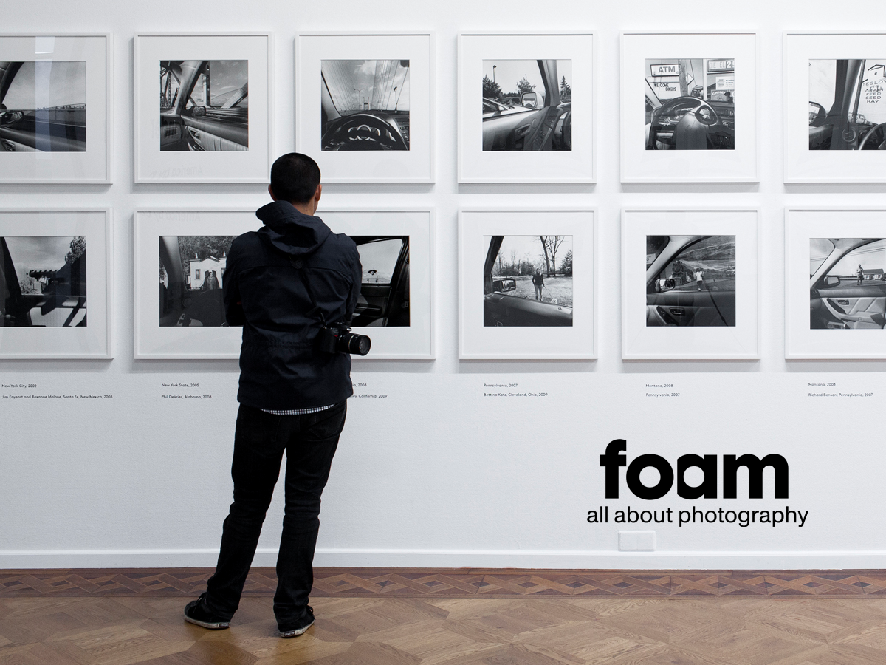

 

<h3 style="color: white;"align="center">Foam Museum</h3>

unfinishedd |  kaansecen 

    
    
    

 

---

 

## Table of contents

- [General info](#general-info)
- [Technologies](#technologies-used)
- [Features](#features)
- [Wireframe](#wireframe)
- [Project Status](#project-status)
- [Contact](#contact)

 

---

 

## General info

 

### Company outing at Foam: Photography course 
 _Experience a fun and educational company outing._  
Companies are invited to come and do a photography workshop with us.  
The workshop is given by a photographer who also exhibits in the museum.  
You and your colleagues can put the photos on a shirt and/or have them printed to take with you.  

During the workshop you will receive a 20-minute explanation about the art of photography in a group of maximum 15 people.  
Then you get to work yourself. You can choose from 3 photos that hang in the museum. We have cameras and other supplies ready. 

 

---

 

## Technologies Used

_Project is created with:_

- HTML5
- CSS3
- Javascript
- PHP
- SQL
- Wordpress
- Woocommerce
- Tailwind CSS
- jQuery

 

---

 

## Features

_List the ready features here:_

- Preloader customisation
- Product customisation
- Page customisation
- Post customisation
- Gallery image uploader

 

---

 

## Wireframe
_Project prototype:_

 

 

 

---

 

## Project Status

Project is: _Finished_.   
   
    

 

---

 

## Contact
_Developed by:_

Created by [@unfinishedd](https://www.unfinishedd.nl)  
Created by [@kaansecen](https://www.kaansecen.nl)

 

---

 
- Feel free to contact us!

 

_This project is open source and available under the Foam Business trademark_.