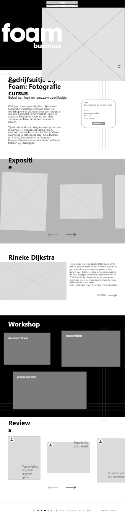

 

<h3 style="color: white;"align="center">Foam Museum</h3>

unfinishedd |  kaansecen 

    
    
    

 

---
 

 

---

 

## Table of contents

- [General info](#general-info)
- [Technologies](#technologies-used)
- [Features](#features)
- [Project Status](#project-status)
- [Contact](#contact)

 

---
 

## General info

_Coming soon..._

 

---
 

## Technologies Used

_Project is created with:_

- HTML
- CSS
- Javascript
- PHP
- SQL
- Wordpress
- Tailwind CSS

 

---
 

## Features

_List the ready features here:_

- Coming soon...

 

---

 

## Project Status

Project is: _in progress_.   
   

 

---

 

## Contact

Created by [@unfinished](https://www.unfinishedd.nl)  
Created by [@kaansecen](https://www.kaansecen.nl)

 

---

 
- Feel free to contact us!

 

_This project is open source and available under the Foam trademark_.